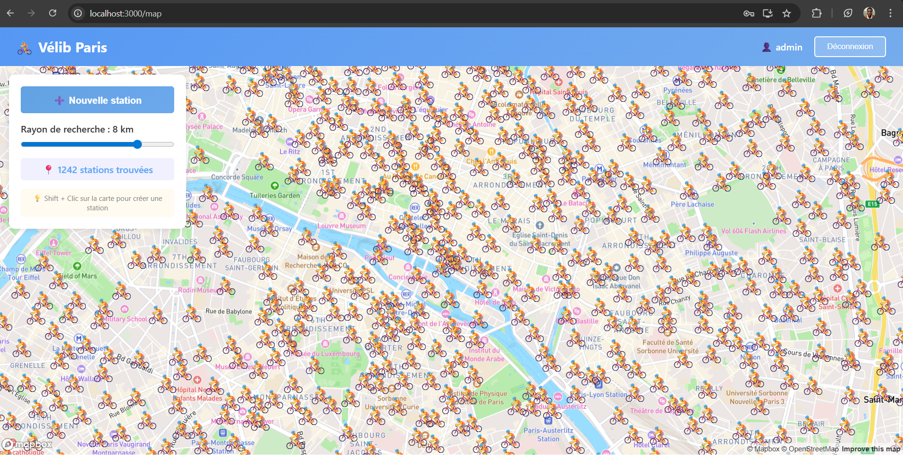

# Application Vélib Paris

Application web full-stack permettant de visualiser et gérer les stations Vélib à Paris sur une carte interactive Mapbox.

## Table des matières

- [Aperçu](#aperçu)
- [Fonctionnalités](#fonctionnalités)
- [Stack technique](#stack-technique)
- [Architecture](#architecture)
- [Installation](#installation)
- [Utilisation](#utilisation)
- [API Documentation](#api-documentation)
- [Structure du projet](#structure-du-projet)
- [Choix techniques](#choix-techniques)
- [Déploiement](#déploiement)

## Aperçu

Cette application permet de :
- Visualiser plus de 1300 stations Vélib sur une carte Mapbox interactive
- Filtrer les stations par rayon de recherche autour d'une position
- Créer, modifier et supprimer des stations (CRUD complet)
- Authentification sécurisée avec JWT



## Fonctionnalités

### Authentification
- Login sécurisé avec JWT (JSON Web Token)
- Session persistante
- Déconnexion

### Gestion des stations
- **Visualisation** : Affichage de toutes les stations sur une carte Mapbox
- **Filtrage** : Recherche par rayon (1-10 km) autour d'une position
- **Création** : Ajout de nouvelles stations via formulaire ou Shift+Clic sur la carte
- **Modification** : Édition des informations d'une station
- **Suppression** : Suppression de stations avec confirmation

### Carte interactive
- Carte Mapbox avec fond de plan streets
- Marqueurs personnalisés (icône vélo 🚴)
- Popups avec informations détaillées
- Navigation fluide et zoom
- Calcul de distance en temps réel

## Stack technique

### Backend
- **Python 3.13**
- **Flask 3.0** - Framework web
- **SQLite** - Base de données
- **Flask-JWT-Extended** - Authentification JWT
- **Flask-CORS** - Gestion CORS
- **Pandas** - Traitement des données CSV
- **Flasgger** - Documentation API (Swagger)

### Frontend
- **React 18** - Interface utilisateur
- **Mapbox GL JS** - Carte interactive
- **Axios** - Requêtes HTTP
- **React Router** - Navigation
- **CSS3** - Styling

## Architecture

L'application suit une architecture **client-serveur** avec séparation stricte frontend/backend :

```
┌─────────────────┐         HTTP/REST API        ┌─────────────────┐
│                 │ ◄──────────────────────────► │                 │
│   React         │         (JSON + JWT)         │   Flask         │
│   Frontend      │                              │   Backend       │
│   (Port 3000)   │                              │   (Port 5000)   │
│                 │                              │                 │
└─────────────────┘                              └────────┬────────┘
                                                          │
                                                          ▼
                                                  ┌─────────────────┐
                                                  │  SQLite         │
                                                  │  velib.db       │
                                                  └─────────────────┘
```

### Séparation des responsabilités

**Backend (Flask)** :
- Expose une API REST
- Gère l'authentification (JWT)
- Accède à la base de données
- Calcule les distances géographiques
- Valide les données

**Frontend (React)** :
- Consomme l'API REST uniquement
- Affiche la carte et les marqueurs
- Gère l'interface utilisateur
- Stocke le token JWT (localStorage)

**Aucun accès direct à la base de données depuis le frontend.**

## Installation

### Prérequis

- Python 3.9+
- Node.js 14+
- npm ou yarn
- Compte Mapbox (token gratuit)

### 1. Cloner le projet

```bash
git clone <url-du-repo>
cd velib-project
```

### 2. Configuration Backend

```bash
cd backend

# Créer un environnement virtuel
python -m venv venv

# Activer l'environnement
# Windows:
source venv\Scripts\activate
# Mac/Linux:
source venv/bin/activate

# Installer les dépendances
pip install -r requirements.txt

# Configurer les variables d'environnement
# Créer un fichier .env avec :
SECRET_KEY=your-secret-key
JWT_SECRET_KEY=your-jwt-secret-key
DATABASE_PATH=velib.db

# Initialiser la base de données et importer les données
python database.py

# Lancer le serveur
python app.py
```

Le backend sera accessible sur `http://localhost:5000`

### 3. Configuration Frontend

```bash
cd frontend

# Installer les dépendances
npm install

# Configurer les variables d'environnement
# Créer un fichier .env avec :
REACT_APP_MAPBOX_TOKEN=pk.votre_token_mapbox
REACT_APP_API_URL=http://localhost:5000/api

# Lancer l'application
npm start
```

Le frontend sera accessible sur `http://localhost:3000`

## Utilisation

### Connexion

Utilisateur par défaut :
- **Username** : `admin`
- **Password** : `admin123`

### Navigation

1. Connectez-vous avec les identifiants
2. La carte s'affiche avec les stations Vélib
3. Utilisez le slider pour ajuster le rayon de recherche
4. Cliquez sur une station pour voir ses détails

### Créer une station

**Méthode 1** : Cliquez sur "Nouvelle station"  
**Méthode 2** : Maintenez Shift + Clic sur la carte

### Modifier/Supprimer

Cliquez sur une station → Utilisez les boutons "Modifier" ou "Supprimer"

## API Documentation

L'API est documentée avec Swagger et accessible à :
```
http://localhost:5000/api/docs
```

### Endpoints principaux

#### Authentification
- `POST /api/login` - Connexion

#### Stations
- `GET /api/stations?lat={lat}&lon={lon}&radius={radius}` - Liste des stations
- `GET /api/stations/{id}` - Détails d'une station
- `POST /api/stations` - Créer une station
- `PUT /api/stations/{id}` - Modifier une station
- `DELETE /api/stations/{id}` - Supprimer une station

Toutes les routes sauf `/api/login` nécessitent un token JWT dans le header :
```
Authorization: Bearer <token>
```

## Structure du projet

```
velib-project/
├── backend/
│   ├── app.py                 # Application Flask principale
│   ├── config.py              # Configuration
│   ├── database.py            # Gestion BDD et import CSV
│   ├── requirements.txt       # Dépendances Python
│   ├── .env                   # Variables d'environnement
│   ├── velib.db              # Base de données SQLite
│   └── velib-pos (1).csv     # Données sources
│
├── frontend/
│   ├── public/
│   ├── src/
│   │   ├── components/
│   │   │   ├── Login.js       # Page de connexion
│   │   │   ├── Map.js         # Carte Mapbox
│   │   │   ├── Navbar.js      # Barre de navigation
│   │   │   ├── StationForm.js # Formulaire CRUD
│   │   │   └── *.css          # Styles
│   │   ├── services/
│   │   │   └── api.js         # Client API
│   │   ├── App.js             # Composant principal
│   │   └── index.js           # Point d'entrée
│   ├── package.json           # Dépendances Node
│   └── .env                   # Variables d'environnement
│
└── README.md                  # Ce fichier
```

## Choix techniques

### Mapbox GL JS au lieu de react-map-gl

J'ai choisi d'utiliser **Mapbox GL JS directement** plutôt que la bibliothèque `react-map-gl` pour les raisons suivantes :

1. **Stabilité** : Incompatibilités entre react-map-gl v5+ et React 18
2. **Contrôle** : Contrôle total sur les marqueurs, popups et événements
3. **Performance** : Optimisation pour afficher 1000+ marqueurs
4. **Documentation** : Documentation officielle Mapbox plus complète

Cette approche reste conforme à l'énoncé (utilisation de Mapbox) tout en garantissant une application stable et performante.

### Gestion de l'état

- **JWT** stocké dans `localStorage` pour la persistance
- **React state** pour la gestion locale (pas de Redux pour ce scope)
- **Refs** pour les références Mapbox (map, markers)

### Sécurité

- Authentification JWT avec expiration (1h)
- CORS configuré pour autoriser uniquement le frontend
- Validation des données côté backend
- Pas de données sensibles dans le frontend

**Note** : Pour la production, il faudrait :
- Hasher les mots de passe (bcrypt)
- HTTPS obligatoire
- Variables d'environnement sécurisées
- Rate limiting sur l'API

## Déploiement

### Préparation pour Azure

#### Backend

1. Créer un fichier `requirements.txt` à jour
2. Ajouter un fichier `startup.sh` pour Azure App Service
3. Configurer les variables d'environnement dans Azure
4. Utiliser Azure SQL Database ou conserver SQLite

#### Frontend

1. Build de production : `npm run build`
2. Déployer sur Azure Static Web Apps ou App Service
3. Configurer les variables d'environnement
4. Mettre à jour `REACT_APP_API_URL` avec l'URL de production

### Variables d'environnement de production

**Backend** :
- `SECRET_KEY` : Clé secrète forte
- `JWT_SECRET_KEY` : Clé JWT forte
- `DATABASE_PATH` : Chemin BDD

**Frontend** :
- `REACT_APP_MAPBOX_TOKEN` : Token Mapbox
- `REACT_APP_API_URL` : URL de l'API en production

## Auteur

HOUNDJO Yann